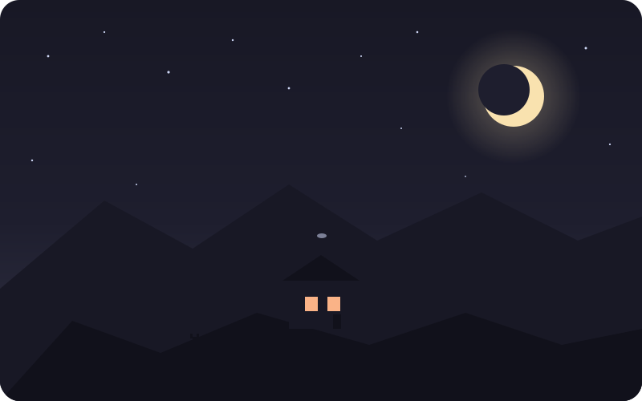
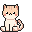
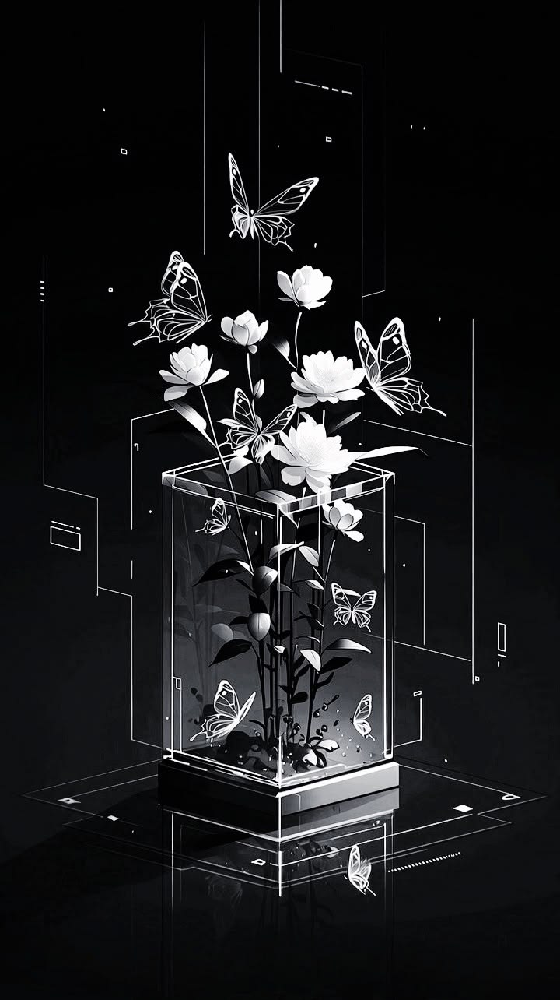
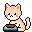
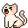

 

 

 

##  About me

I'm Pallandir, a **backend software engineer** ☁️💻 with a background in **cybersecurity** and experience in a **Cloud Center of Excellence**. I've spent the last five years coding, learning, and growing.

> This GitHub marks a **fresh start** where I create, collaborate, and bring inspiring projects to life. 🚀 _(created on 2024)_

Based in **Singapore** 🇸🇬 — currently shifting from full-stack toward **backend development**, **system design**, and building **high-quality software**.

 

 

##  Tech stack

I started as a **full-stack engineer** three years ago, with a strong emphasis on UI design 🎨 and user experience ✨. These days, I'm focused on **backend development** ⚙️, system design 🧠, and building reliable software 🚀.

 

 

 

##  Profile stats

 

 

##  GitHub contributions

<picture>
  <source media="(prefers-color-scheme: dark)" srcset="https://raw.githubusercontent.com/pallandir/pallandir/output/snake-dark.svg"/>
  <source media="(prefers-color-scheme: light)" srcset="https://raw.githubusercontent.com/pallandir/pallandir/output/snake.svg"/>
  
</picture>

> When there are no commits, I'm probably working on other projects or learning something new 🤭.

 

##  Featured projects

 

##  Latest articles

I'm starting to write on **dev.to** — articles will appear here automatically.

<!-- BLOG-POST-LIST:START -->

📝 No articles yet — follow me on <a href="https://dev.to/pallandir">dev.to</a> to be notified when the first one drops.

<!-- BLOG-POST-LIST:END -->

 

##  GitHub trophies

 

  
   &nbsp;Crafted with care · Catppuccin Mocha · Singapore 🇸🇬

