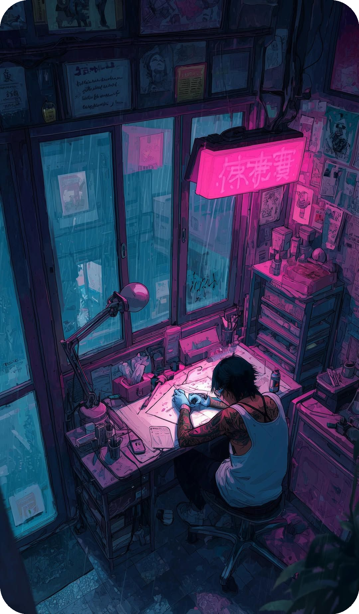
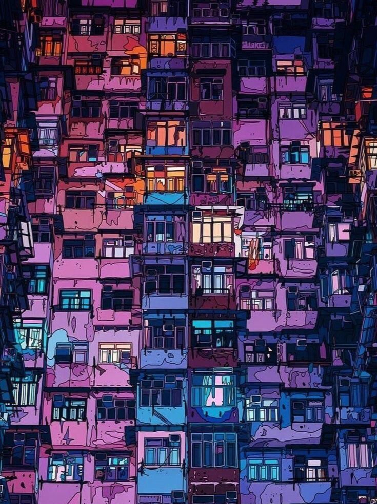

 

 

 

##  About me

&nbsp;

&nbsp;

Hey, I'm Pallandir. I do <b>backend</b> stuff ☁️💻 these days. I started out in <b>cybersecurity</b>, then ended up in a <b>Cloud Center of Excellence</b>, which is a fancy name for the team that gets pulled into the messy cloud questions. Been writing code for around five years.

> I opened this GitHub in 2024 to start over with a clean slate. It's where I keep the things I'm actually proud of, or trying to be. 🚀

I live in <b>Singapore</b> 🇸🇬. Used to do full-stack, but lately I keep getting pulled toward the <b>backend</b> side, <b>system design</b>, and just trying to write software that still makes sense six months later.

 

 

 

##  Tech stack

&nbsp;

&nbsp;

My first real job was <b>full-stack</b>, about three years ago. I spent a lot of time fussing over how things looked 🎨 and felt to use ✨, and honestly I still care about that. But the part I keep coming back to is what's underneath, the APIs ⚙️, how the pieces actually fit together 🧠, the boring plumbing that everything else quietly depends on 🚀.

&nbsp;

&nbsp;

 

 

##  Profile stats

<table>
<tr>
<td width="50%">

</td>
<td width="50%">

</td>
</tr>
</table>

 

##  GitHub contributions

> Quiet weeks usually mean I'm poking at something private, or just reading 🤭.

 

##  Featured projects

&nbsp;

 
 

##  Latest articles

I'm trying to write a bit on <b>dev.to</b>. Whenever I post something, it should pop up here on its own.

<!-- BLOG-POST-LIST:START -->

📝 Nothing posted yet. If you want to catch the first one, you can follow me on <a href="https://dev.to/pallandir">dev.to</a>.

<!-- BLOG-POST-LIST:END -->

 

 

##  GitHub trophies

 

   &nbsp;put together slowly, on quiet evenings · Catppuccin Mocha · Singapore 🇸🇬

