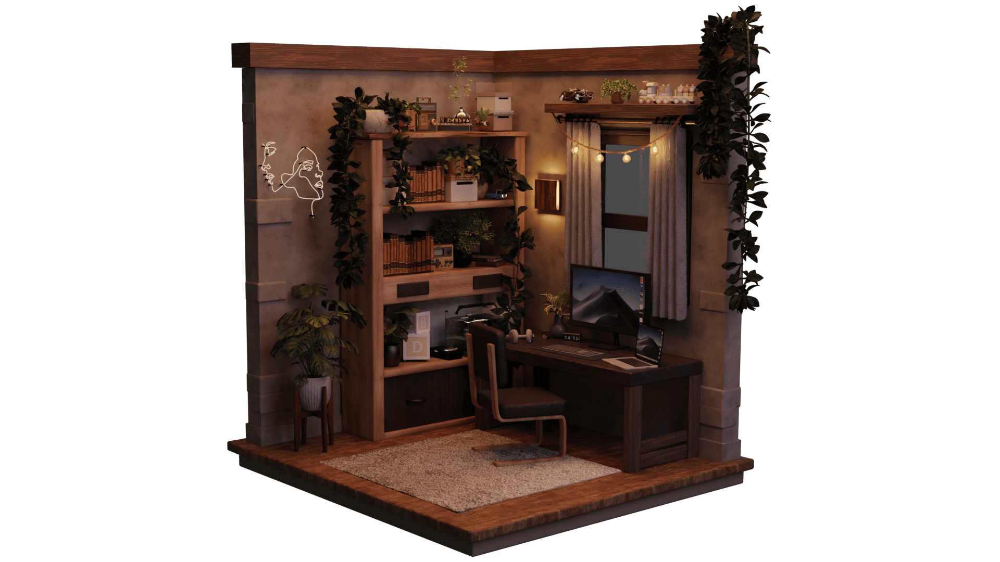

## Hey traveler✨

###### Made with Blender ❤️.

## 📈 Profile stats

  

## 🛠️ Tech Stack

| I'm working with                                                                                                                                                                             |                                                                 I'm learning |
| :------------------------------------------------------------------------------------------------------------------------------------------------------------------------------------------- | ---------------------------------------------------------------------------: |
|  |  |

## 🎖️ GitHub trophies

## 🧪 Roadmap

| Ongoing projects                                   |                                                                                                                 Currently updating                                                                                                                 |                                  Next projects |
| :------------------------------------------------- | :------------------------------------------------------------------------------------------------------------------------------------------------------------------------------------------------------------------------------------------------: | ---------------------------------------------: |
| <ul><li>Workspace as a service (private)</li></ul> | <ul><li><a href="https://github.com/pallandir/leetcode">Leetcode</a></li><li>This page</li><li><a href="https://github.com/pallandir/git_101">Git 101</a></li><li><a href="https://github.com/pallandir/system-design">System design</a></li></ul> | <ul><li>Personal portfolio (private)</li></ul> |

## 🗂️ GitHub contributions

###### When there are no commits, I'm probably working on other projects or learning something new 🤭.
